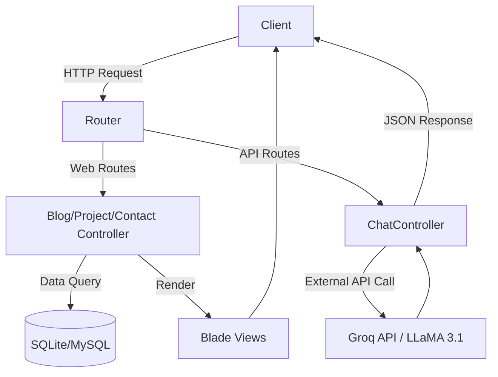

# 🌐 Nusvaa Porto

<p align="center">
  A modern, personal portfolio website built to showcase projects, skills, and growth as a developer. Features an integrated AI assistant to answer questions interactively.
</p>

<p align="center">
  
  
  
  
</p>

---

## 🎯 Tujuan Proyek

Nusvaa Porto dibangun sebagai platform profesional untuk menampilkan profil, portofolio proyek, dan artikel blog pribadi. Selain itu, proyek ini berfungsi sebagai wadah untuk bereksperimen dengan teknologi modern seperti integrasi AI menggunakan Groq API.

---

## 🖼 Preview Proyek

*(Belum teridentifikasi screenshot yang spesifik dari source code, silakan tambahkan screenshot aplikasi di sini)*

Aplikasi ini menyajikan antarmuka pengguna yang bersih dan responsif, lengkap dengan fitur manajemen blog, proyek, serta fitur unggulan berupa asisten chat AI yang mewakili profil *Nusvara*.

---

## ✨ Fitur Utama

- **Project Showcase (CRUD)**: Menampilkan dan mengelola daftar proyek yang telah dikerjakan.
- **Sistem Blog (CRUD)**: Platform untuk menulis dan membaca artikel.
- **Manajemen Kontak (CRUD)**: Fitur untuk menerima dan mengelola pesan dari pengunjung.
- **AI Chat Assistant (Integrasi Groq API)**: Asisten virtual pintar menggunakan model `llama-3.1-8b-instant` yang dirancang khusus untuk menjawab pertanyaan seputar profil Nusvara.
- **Desain Responsif**: Antarmuka modern yang dioptimalkan untuk perangkat *desktop* dan *mobile*.

---

## 🛠 Teknologi yang Digunakan

**Backend**
- **Bahasa Pemrograman**: PHP (>= 8.2.0)
- **Framework**: Laravel 12.0
- **Database**: SQLite (Default) / MySQL

**Frontend**
- **Styling**: Tailwind CSS 4.0.0
- **Templating**: Laravel Blade
- **HTTP Client**: Axios
- **Build Tool**: Vite 7.0.7

**Library/API Tambahan**
- **Groq API**: Digunakan untuk fitur Chatbot AI.

---

## 🏗 Arsitektur Sistem

Proyek ini menggunakan arsitektur **MVC (Model-View-Controller)** standar bawaan Laravel:
- **Model**: Merepresentasikan tabel database (`Project`, `Blog`, `Contact`, `User`).
- **View**: Template Blade untuk merender HTML (`resources/views/pages`).
- **Controller**: Menangani logika bisnis, seperti `ProjectController`, `BlogController`, `ContactController`, dan `ChatController`.



---

## 📂 Struktur Folder

Folder penting dalam proyek ini:
- `app/Http/Controllers/`: Berisi logika utama aplikasi dan handler API.
- `database/migrations/`: Skema tabel database (termasuk users, contacts, blogs, projects).
- `resources/views/`: Berisi file template Blade untuk tampilan frontend.
- `routes/`: Tempat definisi *routing* (`web.php` untuk halaman, `api.php` untuk endpoint AI).
- `public/`: Entry point aplikasi dan tempat menyimpan aset statis/hasil *build*.

---

## 💻 Persyaratan Sistem

- **PHP**: Versi 8.2.0 atau lebih tinggi
- **Composer**: Untuk manajemen dependensi PHP
- **Node.js & NPM**: Untuk manajemen dependensi Frontend (Tailwind/Vite)
- **Database**: SQLite (bawaan) atau MySQL

---

## ⚙ Instalasi

1. **Clone repository**
   ```bash
   git clone https://github.com/NusvaraScript/Nusvaa-Porto.git
   cd Nusvaa-Porto
   ```

2. **Install dependency**
   ```bash
   composer install
   npm install
   ```

3. **Konfigurasi Environment**
   ```bash
   cp .env.example .env
   php artisan key:generate
   ```

4. **Setup Database & Migrasi**
   Pastikan file database SQLite sudah ada (bisa dibuat otomatis oleh Laravel atau manual):
   ```bash
   php artisan migrate
   ```

5. **Menjalankan Aplikasi**
   Jalankan server Vite untuk frontend dan Artisan untuk backend secara bersamaan:
   ```bash
   npm run dev
   # (Atau jika menjalankan manual)
   php artisan serve
   ```

---

## 🔐 Konfigurasi Environment

Beberapa variabel `.env` penting yang perlu disesuaikan:

| Variabel | Fungsi |
|----------|--------|
| `APP_NAME` | Nama aplikasi (Contoh: Nusvaa Porto) |
| `APP_ENV` | Environment aplikasi (`local` atau `production`) |
| `DB_CONNECTION` | Driver database (default: `sqlite`) |
| **Konfigurasi Ekstra (Chat API)** | *Tambahkan konfigurasi Groq secara manual di file .env atau `config/services.php` agar fitur Chat berjalan:* |
| `GROQ_API_KEY` | *(Asumsi)* API Key untuk terhubung dengan layanan Groq. Digunakan di `config('services.groq.key')`. |

---

## 📖 Cara Penggunaan

1. Buka browser dan arahkan ke `http://localhost:8000`.
2. Halaman utama akan menampilkan profil dan ringkasan.
3. Anda dapat bernavigasi ke halaman `/projects`, `/blog`, `/about`, atau `/contact`.
4. Untuk menggunakan asisten AI, gunakan antarmuka chat yang tersedia (yang akan memanggil endpoint API).

---

## 🔌 API Documentation

Proyek ini menyediakan endpoint API khusus untuk fitur asisten virtual.

- **Base URL**: `/api`
- **Endpoint**: `/chat`
- **Method**: `POST`
- **Description**: Mengirim pesan dari *user* dan mendapatkan balasan dari AI (Groq Llama-3.1).

**Request Body (JSON):**
```json
{
  "messages": [
    {
      "role": "user",
      "content": "Halo, ceritakan tentang Nusvara!"
    }
  ]
}
```

**Response Example (200 OK):**
```json
{
  "reply": "Halo! Saya adalah representasi dari Nusvara (Yusuf Usman), seorang Full Stack Developer dari Indonesia. Ada yang bisa saya bantu?"
}
```

---

## 🗄 Database Schema

Tabel-tabel utama yang digunakan dalam proyek ini berdasarkan file migrasi:
- `users`: Tabel bawaan Laravel untuk autentikasi admin/pemilik.
- `contacts`: Menyimpan pesan masuk dari pengunjung.
- `blogs`: Menyimpan data artikel blog (judul, konten, dll).
- `projects`: Menyimpan data portofolio proyek.

---

## 🚀 Deployment

Untuk men-*deploy* ke production server:
1. Set `APP_ENV=production` dan `APP_DEBUG=false` di `.env`.
2. Install dependensi tanpa dev-tools:
   ```bash
   composer install --optimize-autoloader --no-dev
   ```
3. Build aset frontend:
   ```bash
   npm run build
   ```
4. Jalankan migrasi di database server *production*:
   ```bash
   php artisan migrate --force
   ```
5. Arahkan *Document Root* web server (Nginx/Apache) ke folder `/public`.

---

## 🧪 Testing

Aplikasi ini menggunakan PHPUnit bawaan Laravel. Untuk menjalankan pengujian:
```bash
php artisan test
```
*(Jenis testing spesifik belum teridentifikasi dari source code, biasanya meliputi Feature test & Unit test standar).*

---

## 🛡 Security

- **Validasi Input**: Validasi ketat diterapkan pada controller, misalnya `ChatController` membatasi array pesan maksimal 20 dan karakter per pesan maksimal 1000 untuk mencegah *abuse*.
- **CSRF Protection**: Digunakan secara *default* pada *route* `web.php`.
- **API Key Security**: Token Groq disimpan dengan aman dan dibaca melalui fungsi `config()` di *backend*, sehingga tidak terekspos ke *frontend*.

---

## 🚑 Troubleshooting

- **Masalah**: Fitur AI Chat mengembalikan error 500 (`AI service error`).
  - **Solusi**: Pastikan *Groq API Key* Anda sudah dimasukkan dengan benar pada sistem konfigurasi aplikasi (`services.groq.key` / `.env`), dan Anda memiliki kuota API yang cukup.
- **Masalah**: Tampilan berantakan atau *style* tidak ter-*load*.
  - **Solusi**: Pastikan Anda sedang menjalankan `npm run dev` pada *environment local*, atau pastikan Anda telah menjalankan `npm run build` sebelum men-deploy ke *production*.

---

## 🛣 Roadmap

- [x] Konfigurasi awal dan setup repository
- [x] Routing & Controller dasar (Blog, Project, Contact)
- [x] Integrasi AI Chatbot (Groq)
- [ ] Implementasi CMS Dashboard
- [ ] Optimasi SEO
- [ ] Fitur *Dark Mode* terintegrasi

---

## 🤝 Kontribusi

Jika Anda ingin berkontribusi:
1. Fork repository ini
2. Buat branch fitur baru (`git checkout -b feature/AmazingFeature`)
3. Commit perubahan Anda (`git commit -m 'Add some AmazingFeature'`)
4. Push ke branch tersebut (`git push origin feature/AmazingFeature`)
5. Buka Pull Request

---

## 📄 License

Proyek ini dilisensikan di bawah [MIT License](https://opensource.org/licenses/MIT).

---

## 👤 Author

**Nusvara (Yusuf Usman)**
- **GitHub**: [NusvaraScript](https://github.com/NusvaraScript)
- **Portfolio**: [nusvaa.rf.gd](https://nusvaa.rf.gd)

⭐ *If you like this project, feel free to star it!*
